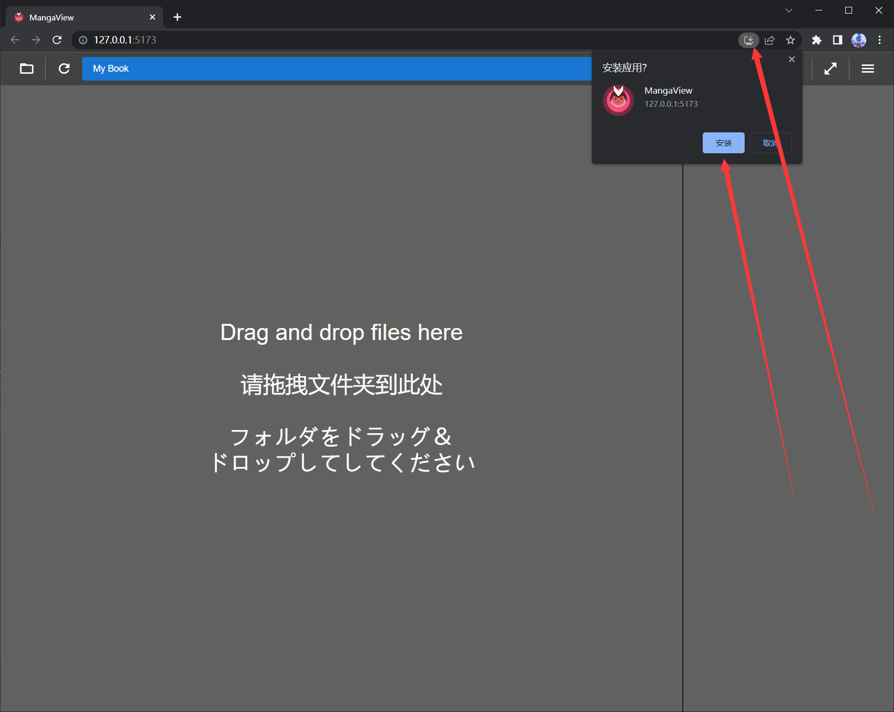
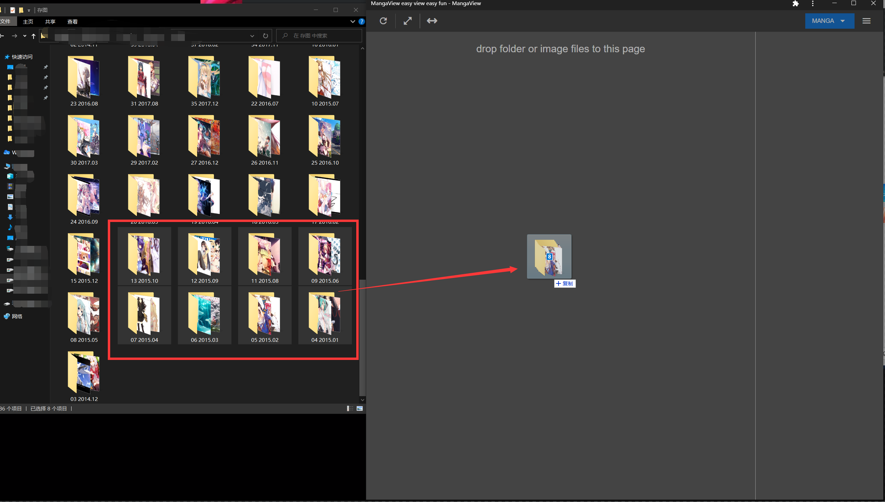
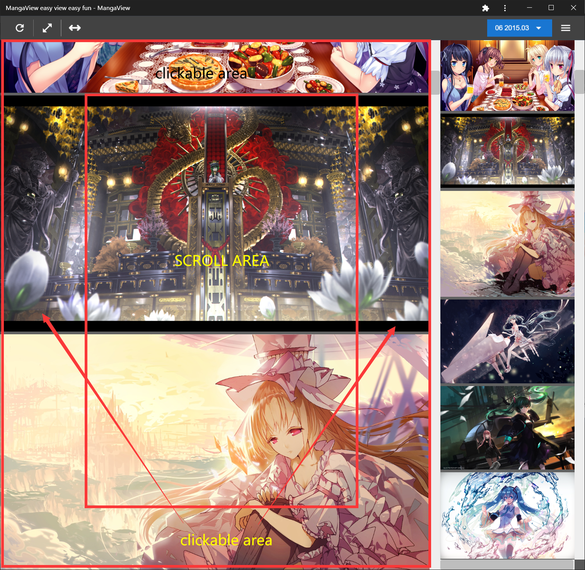

#  mangaview

Manga explorer reader Viewer, only support folders and image files
recommended to use Chrome with latest version

# [install from here](https://nohnolife.github.io/mangaview/dist/index.html)

#### install button on address bar right. and it will be work while offline

#### drag folders into the app.

## but there will not have history record if you refresh or reopen app
#### switch folder

